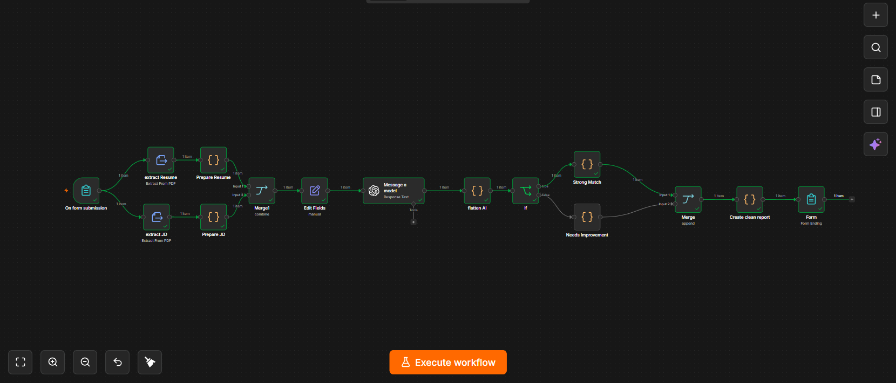

# AI Resume Job Matcher

An n8n workflow that compares a candidate's resume against a job description and returns an AI-generated match report, including a match score, matching skills, missing skills, strengths, and improvement suggestions.

## Overview

The workflow is triggered by a web form where a user uploads their resume and provides a job description. The resume and job description are parsed, sent to an OpenAI model (GPT-5-mini) with a structured prompt, and the model returns a structured evaluation. The result is formatted into a readable report and shown back to the user in the same form.

## workflow


## Workflow Steps

1. **On form submission** – Collects the resume (PDF, required), a job description (text), and/or a job description PDF.
2. **extract Resume / extract JD** – Extracts text from the uploaded PDF file(s).
3. **Prepare Resume / Prepare JD** – Normalizes the extracted text into consistent fields.
4. **Merge1** – Combines resume and job description data into a single item.
5. **Edit Fields** – Sets `resume_text` and `job_description` (using the pasted text or the JD PDF text if no text was entered).
6. **Message a model** – Sends the resume and job description to GPT-5-mini with a structured JSON schema prompt, requesting:
   - `match_score` (0–100)
   - `matching_skills`
   - `missing_skills`
   - `strengths`
   - `suggestions`
7. **flatten AI** – Parses the model's JSON output.
8. **If** – Branches based on whether `match_score >= 80`.
9. **Strong Match / Needs Improvement** – Formats the result differently depending on the branch.
10. **Merge** – Recombines both branches.
11. **Create clean report** – Builds a plain-text summary report.
12. **Form (completion)** – Displays the final report to the user.

## Requirements

- An n8n instance (self-hosted or cloud)
- An OpenAI credential configured in n8n with access to `gpt-5-mini` (or another model, if you update the **Message a model** node)

## Setup

1. Clone this repository:
   ```bash
   git clone https://github.com/<your-username>/<your-repo>.git
   ```
2. In n8n, go to **Workflows → Import from File** and select `ai-resume-job-matcher-github.json`.
3. Set your OpenAI credentials in the **Message a model** node.
4. Activate the workflow.
5. Open the form URL generated by the **On form submission** trigger to use it.

## Notes

- The prompt instructs the model to only count a skill as a match if it is evidenced in the resume, and not to invent experience, technologies, or metrics.
- Resumes must be uploaded as PDF. Job descriptions can be pasted as text or uploaded as PDF.

## License

Add your preferred license here.
